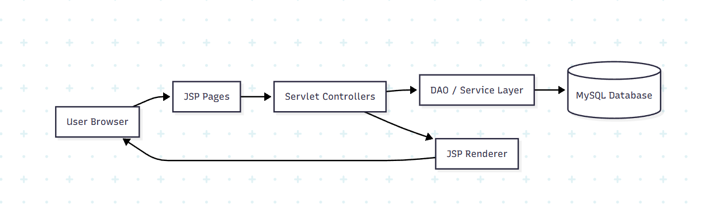
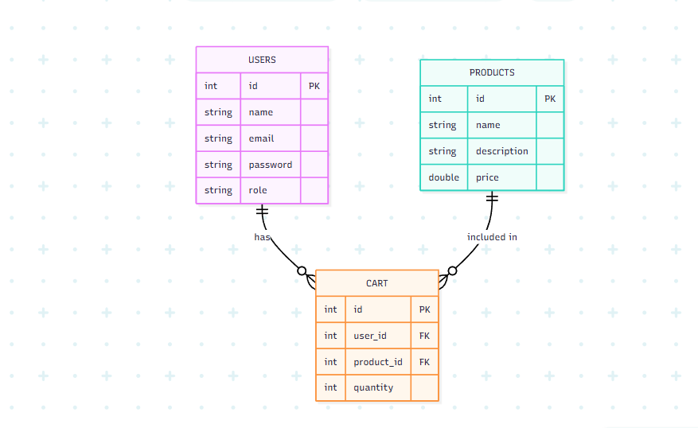
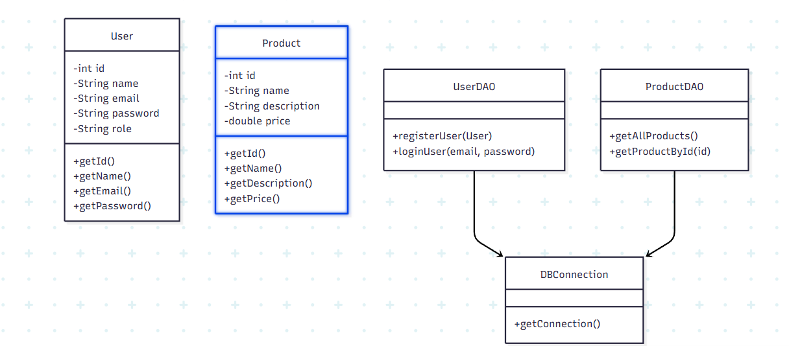
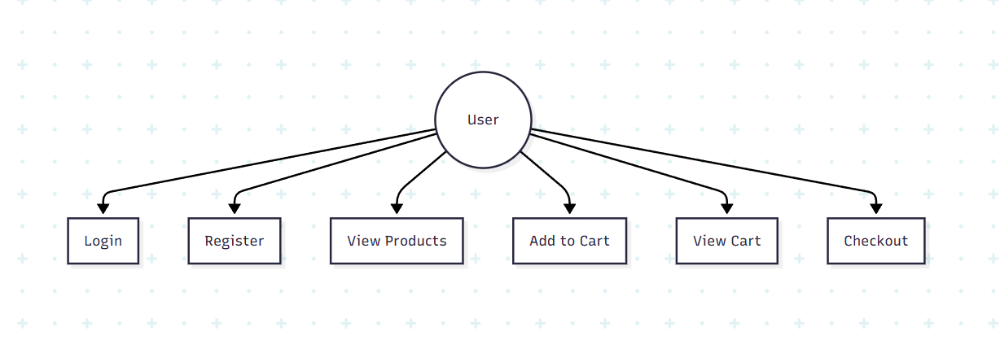
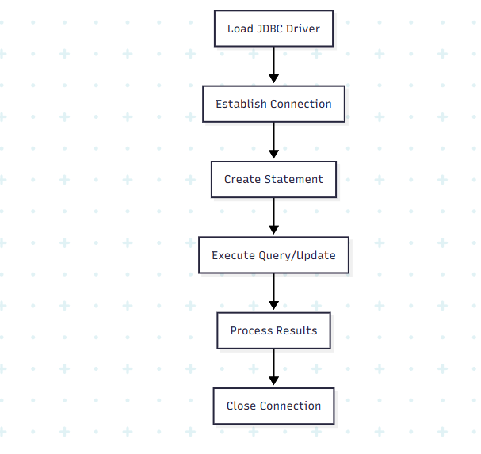

# Online Ecommerce Application (JSP + Servlets + JDBC)

## Project Description
The Online Ecommerce Application is a functional web-based shopping platform built using core Java technologies such as JSP, Servlets, and JDBC. 
The project demonstrates important concepts like user registration, login, session management, product listing, and database connectivity. 
It follows an MVC-like approach—JSP for UI, Servlets for logic, and JDBC for data management—making it ideal for beginners who want to understand Java web application development without frameworks.

## Demo Video


## Installation

### Software Requirements
- **JDK 17 or above**
- **Apache Tomcat 9**
- **Eclipse IDE (Enterprise Edition)**
- **MySQL Server**
- **MySQL Connector/J (JDBC Driver)**

### Project Setup
1. Create a new **Dynamic Web Project** in Eclipse.
2. Set **Apache Tomcat v9.0** as the Target Runtime.
3. Add the MySQL connector JAR into:  
   `src/main/webapp/WEB-INF/lib/`
4. Create MySQL database:
   ```sql
   CREATE DATABASE online_ecommerce;
   ```
5. Create required tables (`users`, `products`).

   ```sql
   CREATE TABLE users(
   id INT PRIMARY KEY AUTO_INCREMENT,
   name VARCHAR(100),
   email VARCHAR(100) UNIQUE,
   password VARCHAR(255),
   role VARCHAR(20) DEFAULT 'USER'
   );

   CREATE TABLE products(
   id INT PRIMARY KEY AUTO_INCREMENT,
   name VARCHAR(100),
   price DOUBLE,
   description TEXT
   );
   ```

6. Insert dummy products into product table.

   ```sql
   INSERT INTO products(name, price, description) VALUES
   ('Laptop', 55000, 'Basic student laptop'),
   ('Headphones', 1500, 'Wireless headphones'),
   ('Keyboard', 800, 'Mechanical keyboard');
   ````
7. Update your DBConnection.java with MySQL username & password.
8. Verify servlet mappings inside:  
   `src/main/webapp/WEB-INF/web.xml`

## Execution Steps
1. Start **MySQL server**.
2. Start **Apache Tomcat** from Eclipse (Servers tab → Start).
3. Deploy the project:  
   `Right-click project → Run As → Run on Server`
4. Open in browser:  
   `http://localhost:8080/OnlineEcommerceApp/`
5. Access login, register, dashboard, and product pages as needed.

---

# 🏗 System Architecture  


---

# 🗄 ER Diagram  


---

# 🏛 Class Diagram  


---

# 📊 Use-Case Diagram  


---

# 🔌 JDBC Workflow

---

# 📁 Project Folder Structure

```
OnlineEcommerceApp/
│
├── README.md
├── .gitignore
├── pom.xml (if using Maven)
│
├── src/
│   ├── main/
│   │   ├── java/
│   │   │   └── com/ecommerce/
│   │   │       ├── controller/
│   │   │       ├── dao/
│   │   │       ├── model/
│   │   │       └── util/
│   │   └── webapp/
│   │       ├── index.jsp
│   │       ├── login.jsp
│   │       ├── register.jsp
│   │       ├── products.jsp
│   │       ├── dashboard.jsp
│   │       ├── cart.jsp
│   │       ├── header.jsp
│   │       └── WEB-INF/
│   │           ├── web.xml
│   │           └── lib/
│   └── test/
│
└── images/
```

---

# 🔄 Sequence

## 🔑 Login Sequence

    actor User
    User ->> LoginServlet: Submit Login Form
    LoginServlet ->> UserDAO: validateUser()
    UserDAO ->> DBConnection: getConnection()
    DBConnection -->> UserDAO: Connection
    UserDAO ->> Database: SELECT * FROM users
    Database -->> UserDAO: User Data
    UserDAO -->> LoginServlet: User Object
    LoginServlet ->> Session: set user
    LoginServlet -->> User: Redirect Dashboard

## 📝 Registration Sequence

    actor User
    User ->> RegisterServlet: Submit Registration Form
    RegisterServlet ->> UserDAO: registerUser()
    UserDAO ->> DBConnection: getConnection()
    DBConnection -->> UserDAO: Connection
    UserDAO ->> Database: INSERT user data
    Database -->> UserDAO: Success
    UserDAO -->> RegisterServlet: OK
    RegisterServlet -->> User: Redirect Login Page


=======
# 📦 Online E-Commerce Platform – SmartBuys

An online marketplace enabling buyers, sellers, and admins to interact seamlessly for smooth digital shopping and business management.
This platform provides a complete workflow including product listing, online shopping, and real-time order tracking.


Presentation - Online E-Commerc…

# 🚀 Current Features
# 👤 Admin Panel

Manage users, products, and orders centrally

Maintain smooth marketplace operations

Monitor platform activity efficiently


Presentation - Online E-Commerc…

# 🛍️ Seller Product Dashboard

Product listings With price

Add to cart button


# 🛒 Buyer Experience

Browse a wide range of products

User-friendly interface for smooth navigation


Presentation - Online E-Commerc…

# 📊 Why E-Commerce?

300M+ online shoppers worldwide

70% growth in digital sales

90% customers prefer online shopping


Presentation - Online E-Commerc…

The rise of digital platforms has transformed modern shopping, providing convenience, global reach, and business opportunities for all stakeholders.

# 🧩 System Architecture

Clear interaction flows between users and backend services

Supports structured data processing across dashboard roles


Presentation - Online E-Commerc…

# 👥 User Types
User Type	Role
Admin	Platform management and oversight
Seller Product management and handling
Buyer	Product browsing and purchasing

All users work together to create a smooth and efficient digital shopping system.


# 🧠 Team – The Hivers

Shree Rajan (Team Leader)

Suhana Kumari

Aashish Kishor

# 📌 Future Enhancements
Create Product 

Make Ordes

Orders listing Page

Payment gateway integration
